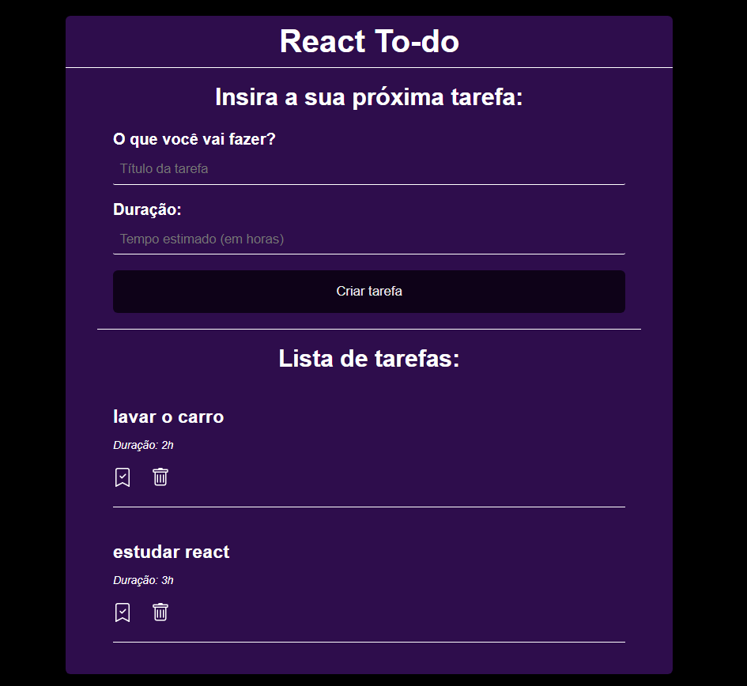

# To-do-list

Esse projeto foi feito com o objetivo de práticar meus conhecimentos de React.js, ou seja, sem fins lucrativos. Também foi feito um simulador de API para os dados das tarefas, a fim de tornar mais fácil manipulação dos mesmos.

# Tecnologias utilizadas
- React.js

# Execução
- baixar ou clonar este repositório;
- executar os comandos: `npm install` e `npm start`, respectivamente para startar o projeto;
- executar o comando `npm run server`, para iniciar uma simulação de API.

# Layout
